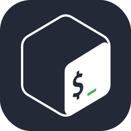
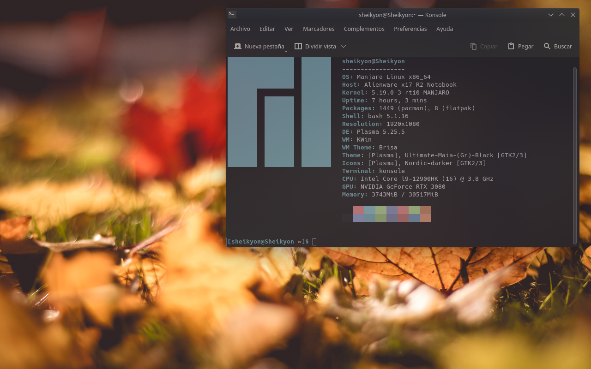

# Hello stranger! I'm Sheikyon. 👋

## About me 📄

Hello! I’m **Sheikyon**, a full-stack developer ~(software developer)~ with a passion for computer science. Besides computing and programming, I like math, economics, philosophy, history and anime. As you may have already noticed, or as you may have noticed, those are the main topics on my site. I have to admit, however, that I am in favor of free and open-source software (FOSS) and an internet free of surveillance and censorship.

I grew up speaking Spanish, but learned English in my preteen years. Apart from Spanish, I speak English, German and Catalan but I have made an effort to learn to defend myself with French and Greek. I have Asperger’s Syndrome (ASD) and Bipolar Disorder (BD).

## Metrics 📊

<!-- GitHub Profile Views Counter -->

## Contact me 📮

I’d like to meet you ― Talk to me. Maybe we can be very good friends.

<ul>
<li>Matrix/Element: <a href="https://app.element.io/#/user/@sheikyon:foss.wtf">@sheikyon:foss.wtf</a>
<ul>
<li>I don't usually use Matrix daily but I have the habit of reviewing it periodically. Talk to me through it, if you like. I have Element installed on all my devices.</li>
</ul>

</li>
<li>Jabber/XMPP: <a href="mailto:sheikyon@anoxinon.me">sheikyon(at)anoxinon(me)</a>
<ul>
<li>This is a perfect place to talk to me about. Use my <a href="https://sheikyon.nl/pgp/xmpp-key.txt" target="_blank">OpenPGP public key</a> for it and make sure to encrypt your messages with <a href="https://en.wikipedia.org/wiki/OMEMO" target="_blank">OMEMO</a> beforehand.</li>
</ul>
</li>
  
<li>Mastodon: <a href="https://mastodon.social/@sheikyon">@sheikyon@mastodon.social</a>
<ul>
<li>Personally, I don't use Mastodon and I don't like it for various reasons that I won't mention. Contact me through him, this is another option.</li>
</ul>
 
</li>
<li>Twitter: <a href="https://twitter.com/Sheikyon">@Sheikyon</a>
<ul>
<li>I am very active on it and use it daily. If you need my help or want to contact me, consider this option.</li>
</ul>
 
</li>
<li>Telegram: <a href="https://t.me/Sheikyon">@Sheikyon</a>
<ul>
<li>An excellent alternative to the previous one. I use Telegram almost daily.</li>
</ul>
</li>
  
<li>Last.fm: <a href="https://last.fm/User/Sheikyon">Sheikyon</a>
<ul>
<li>I don't use this much so use it as the last bullet.</li>
</ul>
</li>
  
<li>Email: <a href="mailto:sheikyon@riseup.net">sheikyon(at)riseup(dot)net</a>
<ul>
<li>Quite secure and private. Send me an encrypted email with my <a href="https://sheikyon.nl/pgp/riseup-key.txt" target="_blank">OpenPGP public key</a>.</li>
</ul>
 
## My skills 💻

  
  
  
  
  
  
  
  
  
  
  
  
  
  
  
  

<b>My neofetch</b>

Nobody asked me, but here you can see my neofetch.

